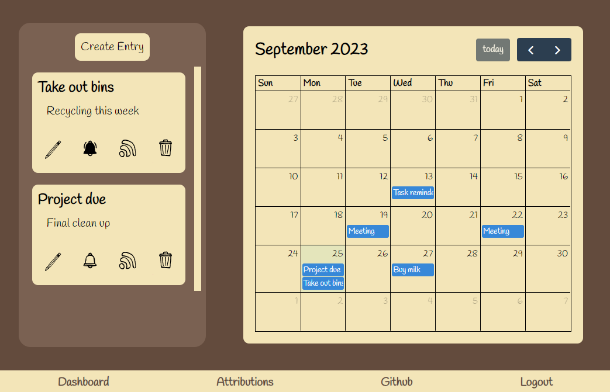

# scribble-space


Scribble Space is a user-friendly task management and planning application designed to help you stay organized and productive. Whether you're managing your daily to-do list or planning long-term projects, SimplePlanner has you covered.



[Link to live deployment](https://gentle-journey-56421-d5fa88de413f.herokuapp.com/)


## Features

- **Intuitive Interface**: Scribble Space offers an easy-to-navigate user interface, ensuring you can start planning right away without a steep learning curve.

- **Task Management**: Create, edit, and delete tasks effortlessly. Organize tasks by categories, due dates, and priorities.

- **Daily, Weekly, and Monthly Views**: Choose your preferred view to see tasks and events at a glance, whether you need to focus on your day, week, or month.

- **Calendar Integration**: Sync your tasks with your favorite calendar apps for seamless scheduling.

- **Reminders and Notifications**: Never miss a deadline with customizable reminders and notifications.

- **Collaboration**: Share your projects and tasks with team members, making collaboration a breeze.


## Getting Started

Follow these steps to get started with Scribble Space:

1. **Installation**: Clone this repository to your local machine.

   ```bash
   git clone https://github.com/Daniel-Bindig/scribble-space
   ```

2. **Dependencies**: Install the project dependencies using npm or yarn.

   ```bash
   npm install
   ```


4. **Database Configuration**: Set up your database configuration in the `.env` file.

   ```env
   DB_HOST=localhost
   DB_PORT=3306
   DB_USER=root
   DB_PASSWORD=your_password
   DB_NAME=scribble_space

   SESSION_SECRET=mySuperSecretKey
   SESSION_DB_HOST=localhost
   SESSION_DB_USER=root
   SESSION_DB_PASSWORD=your_password
   SESSION_DB_NAME=session_db

   VAPID_PUBLIC_KEY=your_public_key
   VAPID_PRIVATE_KEY=your_private_key
   ```

5. **Run the Application**: Start the application.

   ```bash
   node index.js or npm start 
   ```

   SimplePlanner should now be running on `http://localhost:3000`.

## Usage
- **Signing up**: Create an account using the Signup button. Or login to an existing account.

- **Creating Entries**: Click on the "New Entry" button to create a new entry. Fill in the details and save it.

- **Editing Tasks**: Click on a task to edit its details. You can update the title, due date, priority, and more.

- **Deleting Tasks**: To delete a task, simply click the delete button associated with the task.

- **Calendar View**: Toggle between daily, weekly, and monthly views to see your tasks in different formats.

- **Collaboration**: If you're working with a team, invite team members to collaborate on projects. Share project details and tasks to keep everyone aligned.

## Contributing

We welcome contributions to SimplePlanner. If you have any ideas, bug reports, or feature requests, please open an issue or submit a pull request. We appreciate your input!

## License

This project is licensed under the MIT License. 

---

